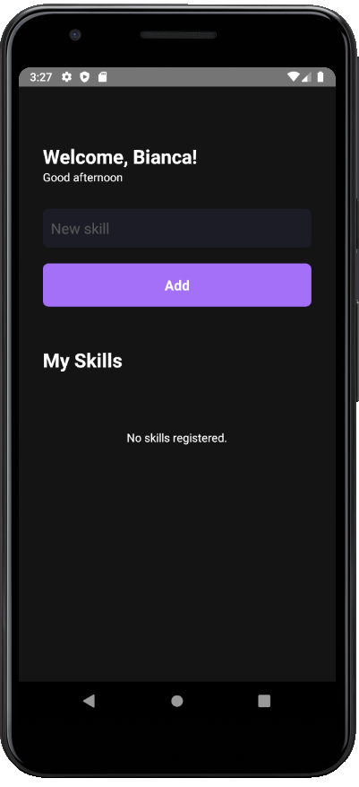
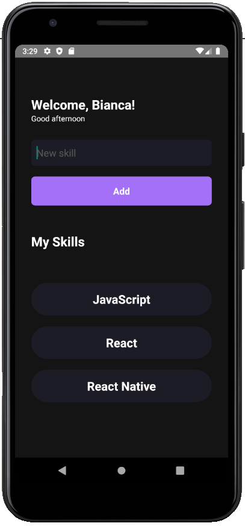

<div align="center">
  <h1>My Skills - Mobile App</h1>
  
  
  
</div>

## The project

**My Skills** is a mobile app to add and show your skills.

This is my first mobile project developed during the Chapter I of the Ignite program (React Native trail) - [Rocketseat](https://rocketseat.com.br/).

---

## Layout

<div>
  
  
</div>

---

## Technologies and tools

- React Native
- Typescript
- Hooks (useState, useEffect)
- Android Studio

---

## How to run the project?

Before start, install and configure [Android Studio](https://developer.android.com/studio) emulator to view the app.

```bash
# Clone this repository
$ git clone https://github.com/cunhasbia/myskills-mobile.git

# Access the repository on your terminal
$ cd myskills-mobile

# Install dependencies
$ yarn

# Run the project
$ yarn run android

# The app will be running on your emulator.
```
Need help? Failed to run? Feel free to contact me.

---
<p align="center">Made with :orange_heart: by Bianca Cunha | Find me on <a href="https://www.linkedin.com/in/biancascunha">LinkedIn</a></p>